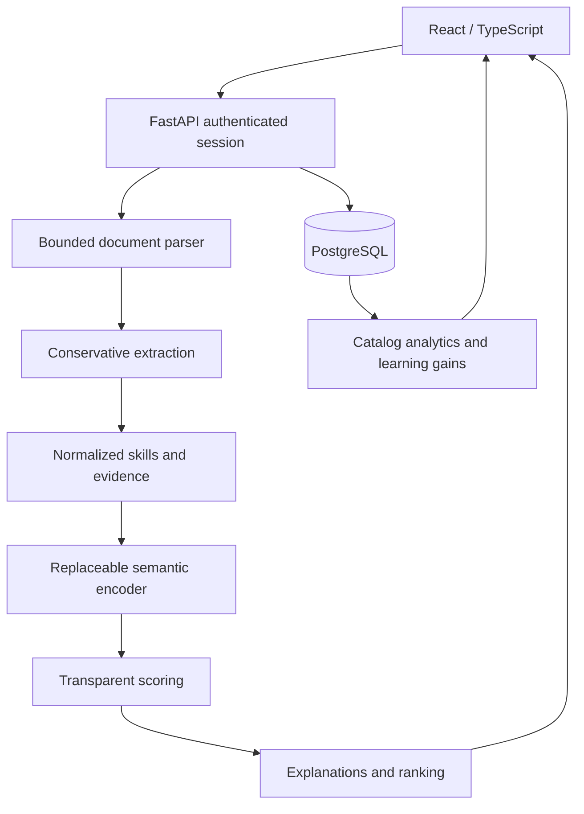

# CareerLens AI architecture

The application is a local-first portfolio reference implementation. It is not a validated hiring system or a production-certified service.

## System and flow



## Folder structure

```text
careerlens-ai/
  backend/app/
    config.py          Environment, limits, model identity
    parsing.py         PDF/DOCX/TXT signature checks, subprocess extraction
    extraction.py      Sections, skills, dates, education and evidence
    embeddings.py      Encoder protocol, MiniLM, explicit offline LSA
    scoring.py         Five score factors and explanations
    analytics.py       Frequencies, co-occurrence, learning gain
    models.py          SQLAlchemy schema and sessions
    main.py            REST endpoints, ownership, error handling
  frontend/
    src/
      App.tsx          Six routed screens and shared UI components
      Chart.tsx        Lazy interactive Plotly wrapper
      api.ts           Session and API boundary
      types.ts         Typed response structures
      style.css        Responsive light/dark theme
    Dockerfile, nginx.conf, package.json, package-lock.json
  data/
    jobs.sample.json   18 explicitly fictional postings
    resume.sample.txt  Fictional profile
    skills.json        Versioned alias taxonomy
    evaluation.json   Nine provisional pairs, human labels initially null
  tests/               Extraction, parsing, scores, recommendations, API, model
  scripts/             Bootstrap, ingestion, model download, evaluation
  docs/                Architecture, model card, evaluation, review, interview prep
  Dockerfile, docker-compose.yml, requirements.txt, .env.example, pytest.ini
```

## Database schema and indexes

| Table | Primary key | Relationships and important fields |
|---|---|---|
| users | id UUID string | unique indexed SHA-256 session token hash; created_at |
| resumes | id | indexed user_id → users; structured JSON; original filename |
| jobs | id | nullable indexed user_id → users; structured JSON; indexed title/location; salary metadata; sample flag |
| skills | name | category and aliases |
| resume_skills | resume_id + skill_name | resumes/skills join; source evidence; reverse skill index |
| job_skills | job_id + skill_name | jobs/skills join; required boolean |
| match_results | id | indexed resume_id and job_id; unique pair; JSON result with model/version |
| recommendations | id | indexed resume_id; role_filter; unique resume+filter; JSON learning plan |

A user owns many resumes and private imported jobs. Shared sample jobs have no owner and are the only globally visible postings. The application never trusts an incoming user ID. Cascading foreign keys remove dependent evidence/results on deletion. SQLAlchemy parameters prevent SQL injection. Indexes support owner queries, job filters, and pair lookups. Leading-wildcard role filtering does not benefit from a simple B-tree; use PostgreSQL trigram indexes for scale. JSON is portable across PostgreSQL and the explicit SQLite development option; JSONB/GIN is a future PostgreSQL-specific optimization.

Schema bootstrap uses SQLAlchemy create_all and is idempotent for a fresh database. It is NOT an upgrade migration engine. The generated initial schema is in schema.sql. Add Alembic migrations before evolving a deployed database; do not rely on create_all to change existing columns.

## API architecture

JSON bodies are Pydantic-validated; request text is limited to 40,000 characters and files to 5 MB. All private routes require a bearer session token. OpenAPI is at /docs on the backend and /api/docs through Docker; API_ROOT_PATH configures the reverse-proxy prefix.

| Method / path | Request | Response |
|---|---|---|
| POST /session | none | newly generated anonymous bearer token |
| DELETE /session | bearer | deletes session and all its records |
| POST /resume/upload | multipart file PDF/DOCX | ID and structured profile |
| POST /resume/text | text | ID and structured profile |
| GET /resumes | bearer | session's parsed resumes |
| DELETE /resume/{id} | bearer | delete owned resume and results |
| POST /job/analyze | text, optional title/location | structured job with required/preferred skills |
| POST /job/upload | PDF/DOCX/TXT file | structured job |
| POST /match | resume_id, job_id | score, coverage, factors, evidence, gaps |
| GET /recommendations | resume_id, optional role | ranked jobs and learning opportunities |
| GET /market/analytics | optional role | frequencies, matrix, salary records, role counts |
| GET /jobs | optional role | visible sample/private catalog |
| GET /skills | none | taxonomy |
| GET /health | none | database connectivity and configured encoder |
| POST /demo/profile | bearer | explicitly fictional sample resume |

## ML pipeline and data flow

1. Validate extension, magic bytes, compressed size and expanded DOCX budget.
2. Parse in a spawned process with 12-second parent deadline, CPU/memory budgets where supported.
3. Normalize Unicode and whitespace; retain section boundaries.
4. Identify section headings, explicit skills and evidence spans. Degree and experience may be unknown.
5. Normalize aliases through a separate taxonomy JSON; never invent skills from a model's prose.
6. Select work/project statements and skills, exclude name and university strings, contacts and common sensitive metadata.
7. Generate normalized embeddings from overlapping 100-word chunks. Similarity uses clipped cosine.
8. Combine available score factors and expose weights, contributions and coverage.
9. Render explanations from extracted evidence; missing detection is phrased as uncertainty.
10. Rank catalog jobs using the same matcher. Compute learning scenarios from catalog requirements.

## Frontend architecture

BrowserRouter exposes /dashboard, /resume, /job-match, /jobs, /market-insights, /skill-gap. Shared Metric, Tags, MatchResult, JobRows and LearningCards components keep the presentation consistent. App holds session-scoped UI state; parsing/scoring/statistics live entirely on the backend. api.ts handles bearer requests and readable errors. Plotly loads only for insights. Raw resume text is not put in browser storage; only the anonymous token and theme persist locally. The current resume is selectable. Missing, busy, empty and error states are explicit. Charts have companion data tables. Nginx provides SPA fallback and /api reverse proxy.
